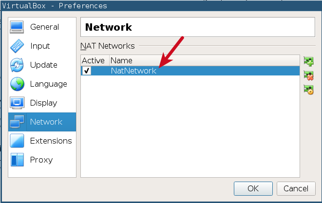
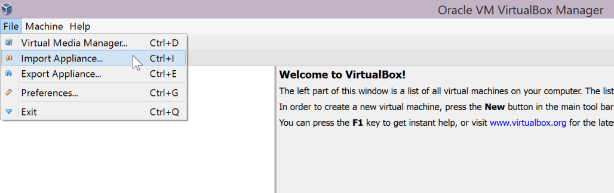
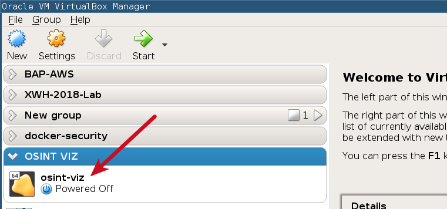

# Getting Started


## Steps to get started
1. Copy the ova file to a local drive
2. Install Virtual Box (skip if already installed)
3. Import the Virtual Machine Appliance
4. Ensure all the settings are working

### Virtualbox Host-Only Adapter


### Virtualbox NatNetwork  Adapter



### Setting up the virtual machine


#### Import the Appliance 




#### Settings for Appliance Import


#### If you face an error while importing


#### Virtual Machine Imported





- Start the `osint-viz` VM


#### Login into the VM and open terminal

- Username: **student**
- Password: **osintviz@dc26**


#### Are you able to ping a machine on the Internet from the VM?

```
ping appsecco.com
```

#### Are you able to access the services on VM from the host?

- In your host machine, navigate to **VM-IP-ADDRESS**