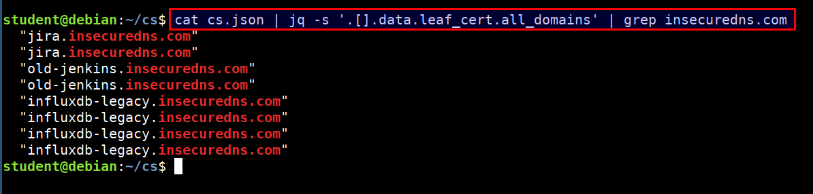

# Before monitoring 

## Taking a look at the data

- You can take a look at the contents in the file `cs.json`

```
cd /home/student/cs/

cat cs.json | jq -s '.[0]'
```

- We can also look for certain domain using below query

```bash
cd /home/student/cs/

cat cs.json | jq -s '.[].data.leaf_cert.all_domains' | grep insecuredns.com
```



## How did we gather the data?

- We ran [certstream-server](https://github.com/CaliDog/certstream-server) by Cali Dog Security. The   `certstream-server` connects to known CT log servers, retrieves the SSL/TLS certificates at near real time, parses the certificate and returns the data as a JSON object. You can run `certstream-server` locally inside a docker container using the following commands

```bash
git clone https://github.com/CaliDog/certstream-server.git
cd certstream-server
docker build -t cert-stream .
docker run -p 4000:4000 cert-stream:latest
```

- The script `cert_stream.py` connects to the `certstream-server` running locally on port 4000. The script also writes the JSON data to the file `cert_stream.json`. You can find `cert_stream.py` script in the VM at `/home/student/code/scenario-1/cert_stream.py`
- Each JSON element in the file `cert_stream.json` represents a SSL/TLS certificate and the data regarding that certificate
- Our `cert_stream.py` will keep writing the CT log data to `cert_stream.json` which is the data around SSL/TLS certificates being appended to known CT logs gloablly. This data could get really large over a period of time so you need to manage it with some sort of a log rotation