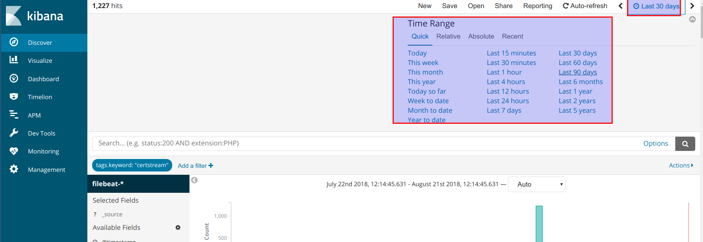
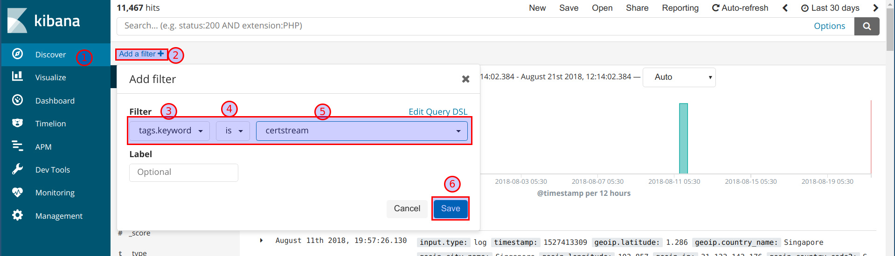

# Monitoring the data stream

Once we have the data collected from the certificate transparency logs in JSON format, we will be using ELK stack to parse them and visualise

## Filebeat configuration

### Configuring the Filebeat to send JSON data to logstash

* Filebeat configuration has been done at `cat /etc/filebeat/filebeat.yml` to send logs to logstash. The JSON data is taken from `/home/student/cs/cs.json`

```yaml
filebeat.inputs:
- type: log
 enabled: true
 paths:
   - /home/student/cs/cs.json
 tags: ["certstream"]

processors:
- decode_json_fields:
    fields: ['message']
    target: ""

output.logstash:
  hosts: ["localhost:5044"]
```

## Logstash configuration

### Configuring logstash to recieve logs from filebeat and send to Elasticsearch

* The logstash input configuration is at `cat /etc/logstash/conf.d/02-beats-input.conf`

```conf
input {
  beats {
    port => 5044
    #ssl => true
    #ssl_certificate => "/etc/pki/tls/certs/logstash-forwarder.crt"
    #ssl_key => "/etc/pki/tls/private/logstash-forwarder.key"
  }
}
```

* Certstream logs filter configuration is at `cat /etc/logstash/conf.d/11-certstream-filter.conf`. Currently we are not applying any filters

```conf
filter {
if "certstream" in [tags] {

  }
}
```

* Output to elasticsearch configuration at `cat /etc/logstash/conf.d/30-elasticsearch-output.conf`

```conf
output {
  elasticsearch {
    hosts => ["localhost:9200"]
    #sniffing => true
    manage_template => false
    index => "%{[@metadata][beat]}-%{+YYYY.MM.dd}"
    document_type => "%{[@metadata][type]}"
  }
}
```

## Kibana configuration

* Navigate to the Kibana dashboard using VM IP address `http://VMIPADDRESS`. Credentials for the basic authentication are as follows

```
username: elkadmin
password: osintviz@321
```

* Create new filebeat index pattern in Kibana


* Select the `timestamp` filed for time filter field


* As we are using existing logs, we can change the timestamp for past 30 or 90 days by selecting the time range



* Now, we can create a new discover filter to only search for the `certstream` logs



* Also creating custom search to look at logs in simpler view for analysis


* We can query the required results using the apache lucene syntax in kibana discover search field. For example `data.leaf_cert.all_domains: "jira.insecuredns.com"`


## Detection of sub-domains

* We can use opensource tools like elastalert to setup automated alerts based on new domains using the rules
* The below rule is the example rule to alert based on new domain SSL/TLS certificate creation. The `*.DOMAINNAME.COM` is the domain we are monitoring

```yaml
es_host: localhost
es_port: 9200
name: "New certificate alert"
type: frequency
index: filebeat-*
num_events: 1
timeframe:
  minutes: 1

# For more info: http://www.elasticsearch.org/guide/en/elasticsearch/reference/current/query-dsl.html

filter:
- query:
    query_string:
      query: 'tags: "certstream" AND name: "*.DOMAINNAME.COM"'

alert:
  - slack

slack:
slack_webhook_url: "https://hooks.slack.com/services/xxxxx"
slack_username_override: "alert-bot"
slack_emoji_override: "robot_face"

realert:
  minutes: 0
```