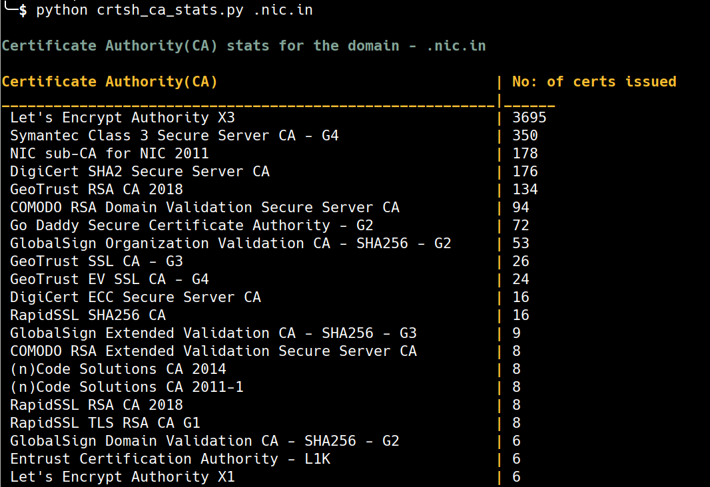

# Use cases and ideas

## Some examples?

- In this scenario we have only scratched the surface of what is possible with CT log data from monitoring point of view
- CT log data can be used in creative ways to build proactive monitoring systems that can aid us in both offense and defense
- We have only looked at CT logs monitoring in near real time but CT logs are append-only which paves way to interesting monitoring scenarios 

## Defensive Monitoring

- If you are responsible for an organisation's infrastructure security, you can use CT log data to monitor for rogue certificates issued against your organisation's domains both historically and in near real-time
- If you are managing a domain, you can use CT log data to monitor for any phishing domains that are setup to target your domain

## Offensive Monitoring

- If you are a bug bounty hunter, you can constantly monitor CT logs to find juicy targets that are in scope for a bug bounty program. There are folks who maintain [list of all the domains that are part of a bug bounty programs](https://github.com/arkadiyt/bounty-targets-data). A monitoring system using the list of these domains and CT log data can be used to automate identifying targets for your bug bounty hunting

## Internet wide research

- CT logs contain valuable data and the append-only nature of the logs makes it a treasure trove of historical information as well. CT logs can come in handy to understand Public key infrastructure both 
- For example, we wrote [quick scripts](https://github.com/yamakira/ctlog-utilities) to figure out the which CA issued the highest number of certificates ever(that are logged in CT logs) and also for a given domain, number of certificates issued by a CA

