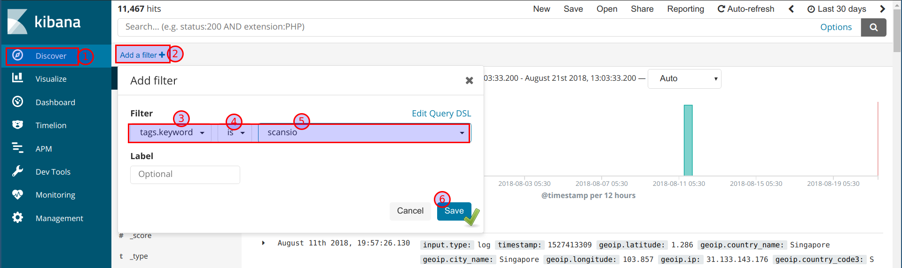
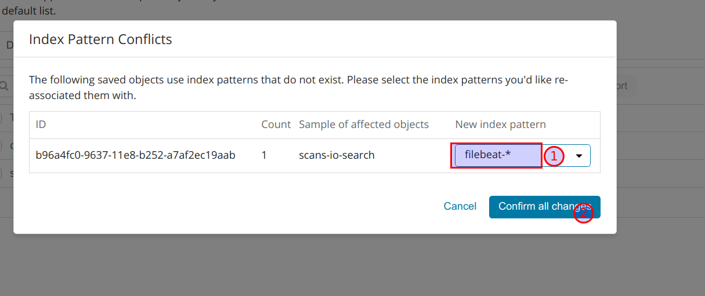
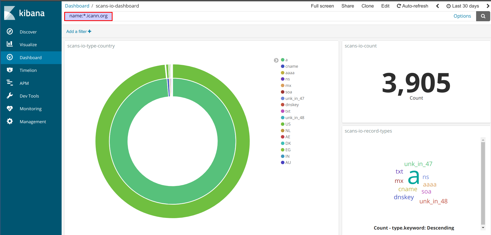

# Monitoring and identifying subdomains

## Filebeat configuration

### Configuring the Filebeat to send JSON data to logstash

* Filebeat configuration has been done at `cat /etc/filebeat/filebeat.yml` to send logs to logstash. The JSON data is taken from `/home/student/si/fdns_data_trimmed.json`

```yaml
filebeat.inputs:
- type: log
 enabled: true
 paths:
   - /home/student/cs/cs.json
 tags: ["certstream"]

- type: log
 enabled: true
 paths:
   - /home/student/si/fdns_data_trimmed.json
 tags: ["scansio"]

processors:
- decode_json_fields:
    fields: ['message']
    target: ""

output.logstash:
  hosts: ["localhost:5044"]
```

## Logstash configuration

### Configuring logstash to recieve logs from filebeat and send to Elasticsearch

* scans.io logs filter configuration is at `cat /etc/logstash/conf.d/12-scansio-filter.conf`. Currently we are applying geoip filter to enrich the IP address information.

```conf
filter {
if "scansio" in [tags] {
geoip {
  source => "value"
  }
 }
}
```

## Kibana configuration

Now we have the dataset for analysis. We will leverage the power of Kibana to visualise and represent the data.

* We can apply the filtered results by select only `scansio` logs in Kibana



* Now we can select the required fields to view using the discover field options and we can save this search for later use


* We have already created a pre defined dashboards. We can import them using Management -> Saved Objects


* The imported dashboard will ask to overwrite the index. Select "Yes, overwrite all objects"


* Then select the `filebeat` index to overwrite the changes, as we store data in same index



* Finally, we can see the dashboard live in the dashboard section


* We can query the data using the apache lucence queries and the entire dashboard will reflect the data based on the query. For example look for only `name:*.icann.org`



* This can be used to query and gather information from large amount of datasets in simpler way