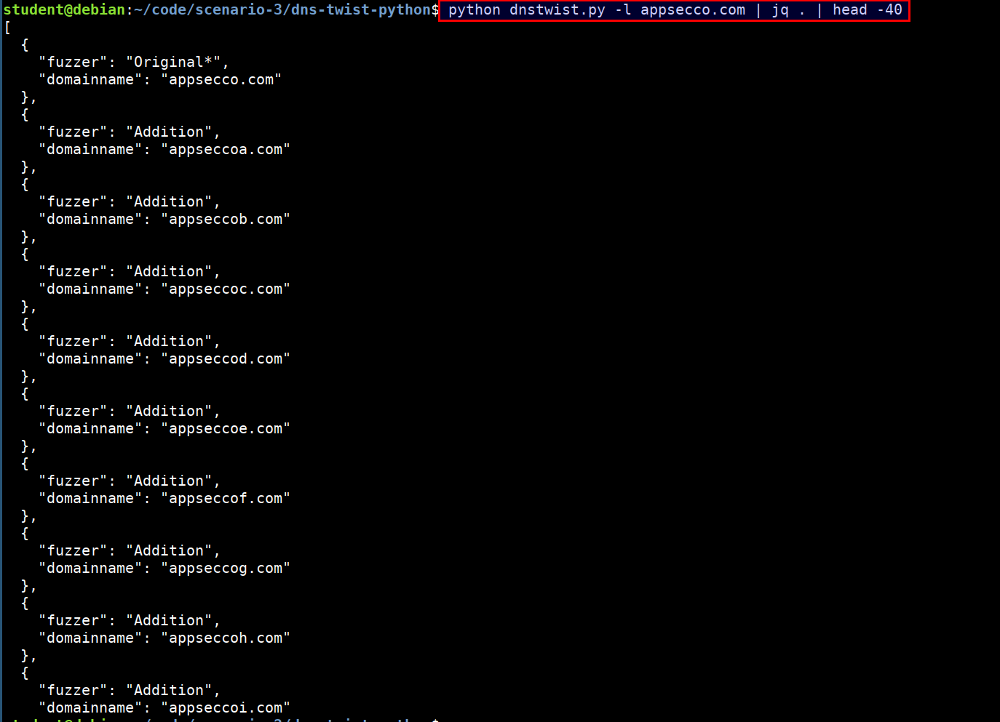

# Before monitoring 

## Generate a list of possible phishing domains for a given domain

- Navigate to the folder `/home/student/code/scenario-3/dns-twist-python`
- Run the script `dnstwist.py` in the folder 

```bash
python dnstwist.py -l appsecco.com | jq . | head -40
```




```bash
python dnstwist.py -l example.com | jq .[].domainname
```

- You notice that a list of domain names are generated
- Generate a list of possible phishing domains for `insecuredns.com`

```
python dnstwist.py -l insecuredns.com | jq .[].domainname
```

## Explanation

- The script `dnstwist.py` uses various techniques to identify the possible phishing domains for a domain and returns a JSON object with list of possible phishing domains and the technique used to suspect the domain as phishing domain
- We are only extracting the list of possible phishing domains