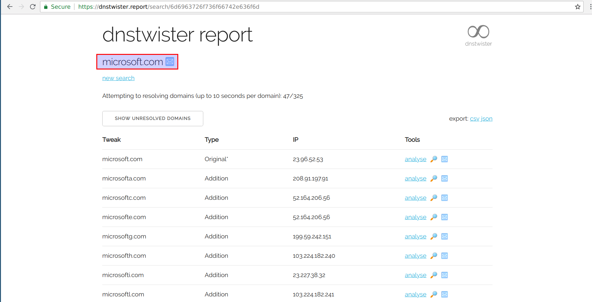

# Data Source

- To make phishing more convincing, scammers will use certificates, to sell into the idea of user security and privacy.
- These will come up in the CT logs

## Gather SSL/TLS certificates

- Under Certificate Transparency(CT), a Certificate Authority(CA) will have to publish all SSL/TLS certificates they issue in a public log
Anyone can look through the CT logs and find certificates issued for a domain
- Details of known CT log files can be found at - https://www.certificate-transparency.org/known-logs
- CT logs by design contain all the certificates issued by a participating CA for any given domain. These logs are available publicly and anyone can look through these logs
- CT logs are append-only and the integrity of the data is cryptographically verified(Sort of like block chain) 

## List of possible phishing domains

- To search the CT logs for domains, we need a list of domains to look for
- We will use a modified version of [dnstwist](https://github.com/elceef/dnstwist), a domain name permutation engine for detecting typo squatting, phishing and corporate espionage, to generate possible phishing domains for a given domain
- An online service like `https://dnstwister.report` can also do that for you

